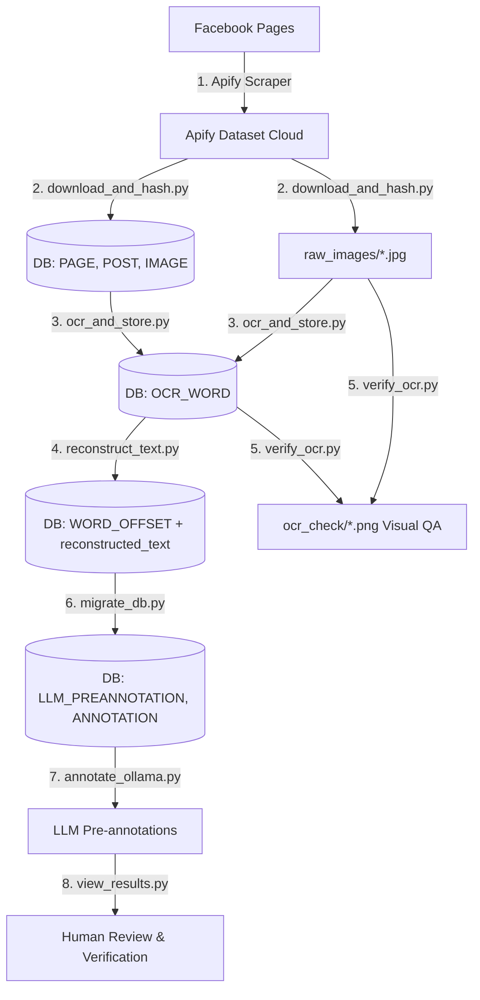
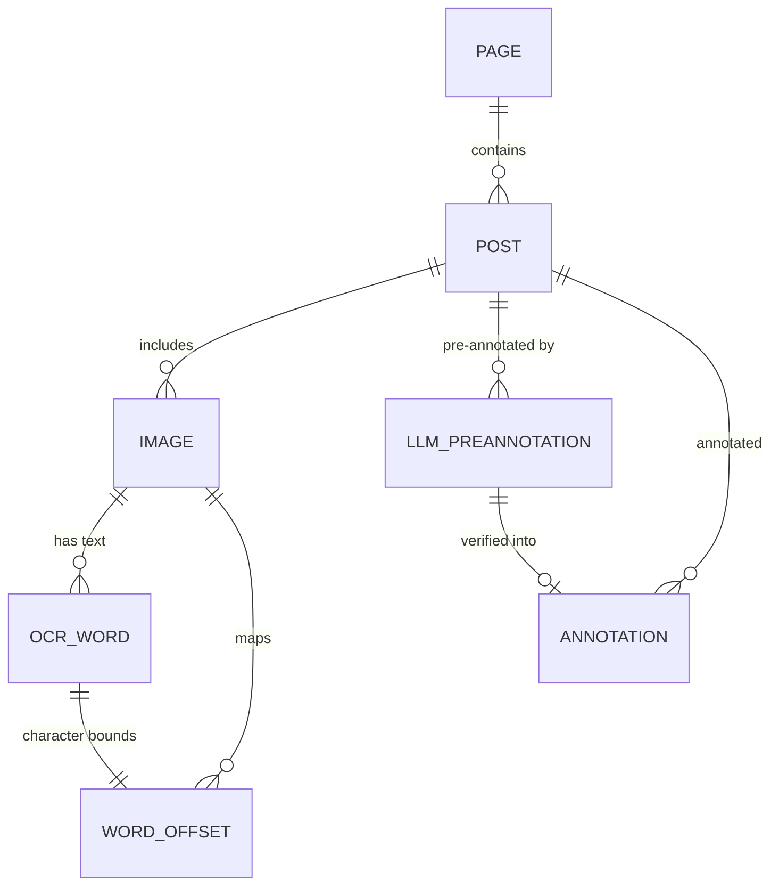

# Bangla Meme Propaganda Dataset

End-to-end pipeline for scraping, downloading, OCR-ing, annotating, and analyzing Bangla propaganda memes.

---

## Table of Contents
1. [Overview & Architecture](#1-overview--architecture)
2. [Project Structure](#2-project-structure)
3. [Environment Setup (Choose One)](#3-environment-setup)
   - [Option A: Docker Setup (Recommended)](#option-a-docker-setup-recommended)
   - [Option B: Bare-Metal Setup (Local Python)](#option-b-bare-metal-setup-local-python)
4. [Step-by-Step Pipeline (From Scratch to End)](#4-step-by-step-pipeline-from-scratch-to-end)
   - [Step 1: Scrape Facebook Posts (Layer 1)](#step-1-scrape-facebook-posts-layer-1)
   - [Step 2: Download Images & Compute Hashes (Layer 2)](#step-2-download-images--compute-hashes-layer-2)
   - [Step 3: Extract Text with EasyOCR (Layer 3)](#step-3-extract-text-with-easyocr-layer-3)
   - [Step 4: Reconstruct Reading-Order Text (Layer 3+)](#step-4-reconstruct-reading-order-text-layer-3)
   - [Step 5: Visual OCR Quality Assurance (QA)](#step-5-visual-ocr-quality-assurance-qa)
   - [Step 6: Database Migration for Annotations (Layer 4)](#step-6-database-migration-for-annotations-layer-4)
   - [Step 7: LLM Pre-Annotation with Ollama (Layer 4)](#step-7-llm-pre-annotation-with-ollama-layer-4)
   - [Step 8: Review & Audit Annotations](#step-8-review--audit-annotations)
5. [Database Schema Reference](#5-database-schema-reference)
6. [Script Reference & CLI Flags](#6-script-reference--cli-flags)
7. [Verification & Useful SQL Queries](#7-verification--useful-sql-queries)
8. [Troubleshooting & FAQ](#8-troubleshooting--faq)

---

## 1. Overview & Architecture

The pipeline processes raw Facebook posts and memes into high-quality multimodal dataset layers with character-level text offsets and LLM pre-annotations:



| Layer | Purpose | Script / Tool | Output |
|---|---|---|---|
| **Layer 1** | Scrape Facebook meme pages/posts | Apify Browser Console | Apify Dataset (`DATASET_ID`) |
| **Layer 2** | Download images + compute SHA-256 & pHash | `download_and_hash.py` | `raw_images/`, tables: `PAGE`, `POST`, `IMAGE` |
| **Layer 3** | EasyOCR text extraction (Bangla + English) | `ocr_and_store.py` | table: `OCR_WORD` |
| **Layer 3+** | Reading-order text reconstruction & char offsets | `reconstruct_text.py` | `IMAGE.reconstructed_text`, table: `WORD_OFFSET` |
| **QA** | Visual OCR bounding box spot-check | `verify_ocr.py` | `ocr_check/*.png` |
| **Layer 4** | Database schema setup for annotations | `migrate_db.py` | tables: `LLM_PREANNOTATION`, `ANNOTATION` |
| **Layer 4** | Zero-shot / few-shot LLM propaganda labeling | `annotate_ollama.py` | table: `LLM_PREANNOTATION` |
| **Audit** | Inspection and human-in-the-loop audit | `view_results.py` | Terminal summaries & review queue |

---

## 2. Project Structure

```
meme_propaganda_dataset/
├── readme.md                      ← Start here
├── .env                           ← Secrets: APIFY_TOKEN, DATASET_ID (never commit)
├── .env.example                   ← Template — copy to .env and fill in values
├── .gitignore
├── requirements.txt               ← Python dependencies
│
├── docker/                        ← All Docker-related files
│   ├── Dockerfile                 ← CUDA 12.4 + Python 3.11 + GPU PyTorch
│   ├── docker-compose.yml         ← App + Ollama services (GPU passthrough)
│   ├── docker-compose.cpu.yml     ← CPU-only override
│   ├── .dockerignore
│   └── Makefile                   ← Shortcuts: make up, make ocr, make annotate, etc.
│
├── ── Pipeline Scripts ──────────── (run in order)
├── download_and_hash.py           ← Step 2: Download images & compute hashes
├── ocr_and_store.py               ← Step 3: EasyOCR extraction (Bangla + English)
├── reconstruct_text.py            ← Step 4: Reading-order text & character offsets
├── verify_ocr.py                  ← Step 5: Visual QA bounding box check
├── migrate_db.py                  ← Step 6: Create annotation tables in DB
├── annotate_ollama.py             ← Step 7: LLM pre-annotation via Ollama
├── view_results.py                ← Step 8: Review annotation results & audit queue
│
├── annotation_ui/                 ← Web UI for human annotators (to be built)
│   ├── app.py                     ← Flask backend
│   ├── templates/                 ← HTML pages
│   └── static/                   ← CSS & JS
│
├── utils/                         ← Helper/utility scripts
│   └── propaganda_dataset_inspect.py  ← Print DB tables, schemas, row counts
│
├── docs/                          ← Documentation & research guides
│   ├── bangla_meme_propaganda_codebook.md       ← 8-technique annotation codebook
│   ├── human_verification_plan.md               ← Human verification UI workflow plan
│   ├── hitl_llm_human_annotation_workflow.md    ← HITL annotation workflow design
│   ├── gpt_prompt_design_guide.md               ← Prompt engineering guide
│   └── multimodal_bangla_propaganda_dataset_plan.md ← Full dataset plan
│
└── ── Generated Data (Gitignored) ──
    ├── propaganda_dataset.db      ← SQLite DB (metadata, OCR, annotations)
    ├── raw_images/                ← Downloaded meme images (.jpg)
    └── ocr_check/                 ← QA bounding-box annotated images (.png)
```

---

## 3. Environment Setup

Choose **Option A** (Docker) or **Option B** (Bare-Metal). Configure your environment once, then proceed directly to [Step-by-Step Pipeline](#4-step-by-step-pipeline-from-scratch-to-end).

---

### Option A: Docker Setup (Recommended)

Docker provides an isolated container with CUDA 12.4, PyTorch GPU, and Ollama pre-configured.

#### 1. Clone & Configure Environment
```bash
git clone https://github.com/AbMehedi/meme_propaganda_dataset.git
cd meme_propaganda_dataset
cp .env.example .env
```

Open `.env` and fill in your values:
```env
APIFY_TOKEN=your_apify_token_here
DATASET_ID=your_apify_dataset_id_here
```

#### 2. Start Containers

- **With NVIDIA GPU:**
  ```bash
  docker compose -f docker/docker-compose.yml up -d --build
  ```

- **Without GPU (CPU-Only):**
  ```bash
  docker compose -f docker/docker-compose.yml -f docker/docker-compose.cpu.yml up -d --build
  ```

#### 3. Verify Container GPU Access
```bash
docker compose -f docker/docker-compose.yml exec app python -c "import torch; print('CUDA:', torch.cuda.is_available()); print('Device:', torch.cuda.get_device_name(0) if torch.cuda.is_available() else 'CPU')"
```

#### 4. Pull an Ollama Model (Inside Ollama Container)
```bash
docker compose -f docker/docker-compose.yml exec ollama ollama pull qwen2.5:3b
```

> **Note on Docker commands:** In Docker, you run any pipeline script using:  
> `docker compose -f docker/docker-compose.yml exec app python <script_name>.py`  
> (or use `make -C docker <target>` shortcuts if `make` is installed).

---

### Option B: Bare-Metal Setup (Local Python)

Run directly on your host operating system (Windows/Linux/macOS).

#### 1. Clone & Configure Environment
```bash
git clone https://github.com/AbMehedi/meme_propaganda_dataset.git
cd meme_propaganda_dataset
cp .env.example .env
```

Open `.env` and fill in your values:
```env
APIFY_TOKEN=your_apify_token_here
DATASET_ID=your_apify_dataset_id_here
```

#### 2. Create & Activate Virtual Environment
```bash
python -m venv .venv
```

- **Windows (PowerShell):**
  ```powershell
  .venv\Scripts\Activate.ps1
  ```
  *(If restricted, run once: `Set-ExecutionPolicy -ExecutionPolicy RemoteSigned -Scope CurrentUser`)*
- **Windows (CMD):**
  ```cmd
  .venv\Scripts\activate.bat
  ```
- **Linux / macOS:**
  ```bash
  source .venv/bin/activate
  ```

#### 3. Install CUDA-Enabled PyTorch First
Check your CUDA driver version using `nvidia-smi`, then install the matching wheel:

- **CUDA 12.4+ (RTX 30xx/40xx):**
  ```bash
  pip install torch torchvision torchaudio --index-url https://download.pytorch.org/whl/cu124
  ```
- **CUDA 12.1:**
  ```bash
  pip install torch torchvision torchaudio --index-url https://download.pytorch.org/whl/cu121
  ```
- **CUDA 11.8:**
  ```bash
  pip install torch torchvision torchaudio --index-url https://download.pytorch.org/whl/cu118
  ```
- **CPU-Only (No NVIDIA GPU):**
  ```bash
  pip install torch torchvision torchaudio
  ```

#### 4. Install Project Requirements
```bash
pip install -r requirements.txt
```

#### 5. Verify GPU Acceleration
```bash
python -c "import torch; print('CUDA available:', torch.cuda.is_available()); print('Device:', torch.cuda.get_device_name(0) if torch.cuda.is_available() else 'CPU')"
```

#### 6. Install & Start Ollama
1. Download from [ollama.com/download](https://ollama.com/download) and install.
2. Ensure Ollama is running (`ollama serve` or system tray app).
3. Pull the required model:
   ```bash
   ollama pull qwen2.5:3b
   ```

---

## 4. Step-by-Step Pipeline (From Scratch to End)

Execute these steps in order to build and process the dataset from scratch.

---

### Step 1: Scrape Facebook Posts (Layer 1)

*This step runs in your web browser via Apify Console.*

1. Log in to [Apify Console](https://console.apify.com/).
2. Go to **Store** → Select **Facebook Posts Scraper** (`apify/facebook-posts-scraper`).
3. Enter the target Facebook page URLs and post limit:
   ```json
   {
     "startUrls": [
       { "url": "https://www.facebook.com/<target_page_1>" },
       { "url": "https://www.facebook.com/<target_page_2>" }
     ],
     "resultsLimit": 50
   }
   ```
4. Click **Start**. Once completed, copy the **Dataset ID** from the dataset URL:
   `https://api.apify.com/v2/datasets/<DATASET_ID>`
5. Add your token and dataset ID to `.env`:
   ```env
   APIFY_TOKEN=your_apify_api_token
   DATASET_ID=your_dataset_id_here
   ```

---

### Step 2: Download Images & Compute Hashes (Layer 2)

Fetches post metadata and downloads images locally. Computes SHA-256 (exact duplicate check) and pHash (perceptual near-duplicate check under resize/compression).

| Environment | Command |
|---|---|
| **Docker** | `docker compose -f docker/docker-compose.yml exec app python download_and_hash.py` |
| **Bare-Metal** | `python download_and_hash.py` |

- **Output:** Populates `PAGE`, `POST`, and `IMAGE` tables in `propaganda_dataset.db`, and saves images into `raw_images/<image_id>.jpg`.

---

### Step 3: Extract Text with EasyOCR (Layer 3)

Runs EasyOCR for Bangla (`bn`) and English (`en`) with contrast enhancement (CLAHE), bilateral denoising, and Unicode grapheme cluster splitting (`\X`) to prevent bounding box drift on conjuncts (যুক্তাক্ষর).

| Environment | Command |
|---|---|
| **Docker** | `docker compose -f docker/docker-compose.yml exec app python ocr_and_store.py` |
| **Bare-Metal** | `python ocr_and_store.py` |

- **Output:** Populates the `OCR_WORD` table with word tokens, confidence scores, and bounding boxes (`x1, y1, x2, y2`, `line_x1, line_y1, line_x2, line_y2`).

---

### Step 4: Reconstruct Reading-Order Text (Layer 3+)

Sorts detected words into natural reading order (top-to-bottom, left-to-right), builds a readable string per image, and maps character offsets.

| Environment | Command |
|---|---|
| **Docker** | `docker compose -f docker/docker-compose.yml exec app python reconstruct_text.py` |
| **Bare-Metal** | `python reconstruct_text.py` |

- **Output:** Updates `IMAGE.reconstructed_text` and populates `WORD_OFFSET (ocr_id, image_id, start_char, end_char)`.

---

### Step 5: Visual OCR Quality Assurance (QA)

Draws line bounding boxes (🔴 Red), exact word boxes (🟢 Green), and estimated word boxes (🟠 Orange) onto images for quality spot-checks.

| Environment | Command |
|---|---|
| **Docker** | `docker compose -f docker/docker-compose.yml exec app python verify_ocr.py` |
| **Bare-Metal** | `python verify_ocr.py` |

- **Output:** Saves annotated verification images in `ocr_check/*.png`. Open and inspect sample images visually.

---

### Step 6: Database Migration for Annotations (Layer 4)

Initializes the schema for LLM pre-annotations and human verification records. Safe to run multiple times.

| Environment | Command |
|---|---|
| **Docker** | `docker compose -f docker/docker-compose.yml exec app python migrate_db.py` |
| **Bare-Metal** | `python migrate_db.py` |

- **Output:** Creates tables `LLM_PREANNOTATION` and `ANNOTATION` in `propaganda_dataset.db`.

---

### Step 7: LLM Pre-Annotation with Ollama (Layer 4)

Feeds reconstructed OCR text, captions, and metadata to an Ollama LLM using a strict 8-technique propaganda taxonomy and constrained JSON output.

| Environment | Command |
|---|---|
| **Docker** | `docker compose -f docker/docker-compose.yml exec app python annotate_ollama.py --auto` |
| **Bare-Metal** | `python annotate_ollama.py --auto` |

#### Propaganda Taxonomy (8 Techniques)
| Code | Technique | Description |
|---|---|---|
| **T01** | Loaded Language | Strongly emotional words/phrases designed to influence opinion |
| **T02** | Name Calling / Labeling | Attaching derogatory labels directly to a target |
| **T03** | Smears | Discrediting a target with damaging accusations/unsubstantiated claims |
| **T04** | Appeal to Fear / Prejudice | Exploiting anxiety, existential danger, or collective bias |
| **T05** | Exaggeration / Minimisation | Grossly overstating or minimizing reality |
| **T06** | Slogans | Catchy rallying phrases used as a substitute for logical reasoning |
| **T07** | Appeal to Strong Emotions | Provoking non-fear emotions (pride, anger, grief, pity) |
| **T08** | No Propaganda Technique | Factual, neutral, or non-persuasive content |

#### Recommended Hardware Models
| Model | Min VRAM | Min System RAM | Recommended For |
|---|---|---|---|
| `qwen2.5:14b` | 10 GB | 16 GB | High accuracy (RTX 3080/4080/4090) |
| `qwen2.5:7b` | 5 GB | 8 GB | Standard GPU workflow (RTX 3060/4060) |
| `llava-phi3` | 3.5 GB | 8 GB | Multimodal vision analysis (RTX 3050+) |
| `qwen2.5:3b` | 0 GB (CPU) | 4 GB | Fast CPU-only or low-VRAM machines |

---

### Step 8: Review & Audit Annotations

Inspect model predictions, overall label distribution, and filter posts flagged for human verification.

| Environment | Action | Command |
|---|---|---|
| **Docker** | Summary Stats | `docker compose -f docker/docker-compose.yml exec app python view_results.py --summary` |
| **Docker** | Review Queue | `docker compose -f docker/docker-compose.yml exec app python view_results.py --review-queue` |
| **Bare-Metal** | Summary Stats | `python view_results.py --summary` |
| **Bare-Metal** | Review Queue | `python view_results.py --review-queue` |

**Audit criteria for Human Review Queue:**
- Model explicitly set `needs_review=1`.
- Confidence score is below threshold (`--conf-threshold 0.65`).
- Labeled as T08 (No Propaganda) despite lengthy emotional text present.
- Contradictory technique combinations.

---

### Step 9: Human Verification Web UI (Annotation Tool)

For human annotators to review, edit, and ground-truth LLM pre-annotations through an editorial web interface:

| Environment | Action | Command |
|---|---|---|
| **Bare-Metal** | Start UI Server | `python annotation_ui/app.py` |

Open **`http://localhost:5000`** in your web browser:
1. Enter your annotator name (e.g., `omor`, `mehedi`, `rafiq`).
2. Review the asymmetric 40/60 workspace displaying the meme image, reconstructed Bangla OCR text, AI prediction, confidence meter, and reasoning.
3. Use keyboard shortcuts or one-click action buttons:
   - **`A` / `✓ ACCEPT`**: Confirm model pre-annotation into `ANNOTATION` table.
   - **`E` / `✎ EDIT`**: Slide out inline correction drawer to update technique, modality, or evidence span.
   - **`R` / `✕ REJECT`**: Relabel incorrect predictions (defaults to T08 No Propaganda).
   - **`S` / `⊘ SKIP`**: Defer post for later review.
   - **`←` / `→`**: Navigate previous/next predictions.

---

## 5. Database Schema Reference

The database `propaganda_dataset.db` contains 7 relational tables:



### Table: `PAGE`
| Column | Type | Description |
|---|---|---|
| `page_id` | TEXT (PK) | Facebook page identifier |
| `page_name` | TEXT | Facebook page name / title |
| `page_url` | TEXT | Canonical page URL |

### Table: `POST`
| Column | Type | Description |
|---|---|---|
| `post_id` | TEXT (PK) | Facebook `story_fbid` or hash of permalink |
| `page_id` | TEXT (FK) | Reference to `PAGE(page_id)` |
| `post_url` | TEXT | Permalink to post |
| `timestamp` | TEXT | Post publication timestamp |
| `caption` | TEXT | Post body text |
| `scraped_at` | TEXT | Scrape timestamp |
| `likes` | INTEGER | Like reaction count |
| `comments` | INTEGER | Comment count |
| `shares` | INTEGER | Share count |

### Table: `IMAGE`
| Column | Type | Description |
|---|---|---|
| `image_id` | TEXT (PK) | MD5 hash of image source URL |
| `post_id` | TEXT (FK) | Reference to `POST(post_id)` |
| `file_path` | TEXT | Local file path (`raw_images/<id>.jpg`) |
| `width` / `height` | INTEGER | Dimensions in pixels |
| `image_hash` | TEXT | SHA-256 hash of raw bytes (exact duplicates) |
| `perceptual_hash` | TEXT | 64-bit pHash hex string (near duplicates) |
| `original_image_url` | TEXT | Facebook CDN source URL |
| `fb_alt_text` | TEXT | Automated Facebook alt-text |
| `reconstructed_text` | TEXT | Reading-order text created by `reconstruct_text.py` |

### Table: `OCR_WORD`
| Column | Type | Description |
|---|---|---|
| `ocr_id` | INTEGER (PK) | Auto-incrementing identifier |
| `image_id` | TEXT (FK) | Reference to `IMAGE(image_id)` |
| `line_id` | INTEGER | Line index within image |
| `word` | TEXT | Recognized word token |
| `confidence` | REAL | Confidence score (0.0 to 1.0) |
| `x1, y1, x2, y2` | INTEGER | Word bounding box coordinates |
| `line_x1, line_y1, line_x2, line_y2` | INTEGER | Parent line detection bounding box |
| `bbox_is_estimated` | INTEGER | `0` = direct detection, `1` = proportional grapheme split |

### Table: `WORD_OFFSET`
| Column | Type | Description |
|---|---|---|
| `ocr_id` | INTEGER (PK, FK) | Reference to `OCR_WORD(ocr_id)` |
| `image_id` | TEXT (FK) | Reference to `IMAGE(image_id)` |
| `start_char` | INTEGER | Start index in `IMAGE.reconstructed_text` |
| `end_char` | INTEGER | End index (exclusive) in `IMAGE.reconstructed_text` |

### Table: `LLM_PREANNOTATION`
| Column | Type | Description |
|---|---|---|
| `llm_annotation_id` | INTEGER (PK) | Auto-incrementing identifier |
| `post_id` | TEXT (FK) | Reference to `POST(post_id)` |
| `image_id` | TEXT | Associated image ID |
| `model_name` | TEXT | Model used (e.g. `qwen2.5:3b`) |
| `prompt_version` | TEXT | Version tag (e.g. `v1.0-ollama`) |
| `run_id` | INTEGER | Iteration run number |
| `predicted_label` | TEXT | Technique code (`T01`–`T08`) |
| `modality` | TEXT | `M1` (Text), `M2` (Image), `M3` (Multimodal) |
| `confidence_score` | REAL | Technique confidence (0.0 to 1.0) |
| `rationale_span` | TEXT | Extracted text span triggering the technique |
| `reasoning` | TEXT | Model explanation |
| `raw_response` | TEXT | Full JSON response |
| `needs_review` | INTEGER | `1` if flagged for human review |
| `review_reason` | TEXT | Reason flag was set |
| `overall_confidence` | REAL | Post-level confidence score |
| `created_at` | TEXT | Annotation timestamp |

### Table: `ANNOTATION`
| Column | Type | Description |
|---|---|---|
| `annotation_id` | INTEGER (PK) | Final validated annotation identifier |
| `post_id` | TEXT (FK) | Reference to `POST(post_id)` |
| `technique_label` | TEXT | Validated technique label |
| `modality` | TEXT | `M1` / `M2` / `M3` |
| `start_char` / `end_char` | INTEGER | Character bounds in `reconstructed_text` |
| `evidence_span` | TEXT | Ground-truth text span |
| `annotation_source` | TEXT | `llm_preannotated` or `human` |
| `verification_status` | TEXT | `PENDING`, `VERIFIED`, `REJECTED` |
| `human_annotator_id` | TEXT | ID of reviewer |
| `llm_preannotation_id` | INTEGER (FK) | Reference to `LLM_PREANNOTATION` |

---

## 6. Script Reference & CLI Flags

| Script | Common Flags | Description |
|---|---|---|
| `download_and_hash.py` | *(none)* | Downloads images and generates database entries from `DATASET_ID` |
| `ocr_and_store.py` | *(none)* | Performs EasyOCR on all unprocessed images in `IMAGE` |
| `reconstruct_text.py` | *(none)* | Assembles words into natural reading order and populates `WORD_OFFSET` |
| `verify_ocr.py` | *(none)* | Generates sample visual bounding boxes in `ocr_check/` |
| `migrate_db.py` | *(none)* | Applies schema updates for `LLM_PREANNOTATION` and `ANNOTATION` |
| `annotate_ollama.py` | `--auto` | Automatically detects RAM/VRAM and picks optimal model |
| | `--model <name>` | Manually specify model (e.g. `qwen2.5:7b`) |
| | `--limit <n>` | Only process `n` posts |
| | `--runs <n>` | Number of runs per post for consistency estimation |
| | `--dry-run` | Prints prompts and payloads without calling Ollama |
| | `--info` | Inspects system hardware and supported model tier |
| `view_results.py` | `--summary` | Displays aggregated label distribution and counts |
| | `--review-queue` | Filters posts that need human inspection |
| | `--conf-threshold <f>` | Sets confidence cutoff for review queue (default: 0.65) |
| | `--model <name>` | Filter results by specific model |
| `utils/propaganda_dataset_inspect.py` | *(none)* | Quick summary of table schemas and row counts |

---

## 7. Verification & Useful SQL Queries

You can inspect the database at any time using SQLite:
```bash
sqlite3 propaganda_dataset.db
```

Or with the built-in python script:
```bash
python utils/propaganda_dataset_inspect.py
```

### Useful SQL Queries
```sql
-- 1. Check counts across all layers
SELECT
  (SELECT COUNT(*) FROM PAGE) AS pages,
  (SELECT COUNT(*) FROM POST) AS posts,
  (SELECT COUNT(*) FROM IMAGE) AS images,
  (SELECT COUNT(*) FROM OCR_WORD) AS ocr_words,
  (SELECT COUNT(DISTINCT image_id) FROM OCR_WORD) AS ocred_images;

-- 2. Inspect reconstructed text and character offsets
SELECT i.image_id, i.reconstructed_text, w.word, o.start_char, o.end_char
FROM IMAGE i
JOIN WORD_OFFSET o ON i.image_id = o.image_id
JOIN OCR_WORD w ON o.ocr_id = w.ocr_id
WHERE i.reconstructed_text IS NOT NULL
LIMIT 10;

-- 3. Label distribution & average confidence
SELECT predicted_label, COUNT(*) AS count,
       ROUND(AVG(confidence_score), 3) AS avg_conf,
       SUM(needs_review) AS flagged_for_review
FROM LLM_PREANNOTATION
GROUP BY predicted_label
ORDER BY count DESC;
```

---

## 8. Troubleshooting & FAQ

### 1. `CUDA available: False`
- **Cause:** PyTorch was installed from standard PyPI (CPU version).
- **Fix:** Inside your `.venv`, reinstall with explicit CUDA wheel:
  ```bash
  pip uninstall -y torch torchvision torchaudio
  pip install torch torchvision torchaudio --index-url https://download.pytorch.org/whl/cu124
  ```

### 2. Docker fails with NVIDIA GPU error
- **Cause:** NVIDIA Container Toolkit is missing or outdated.
- **Fix:** Install [NVIDIA Container Toolkit](https://docs.nvidia.com/datacenter/cloud-native/container-toolkit/latest/install-guide.html) or run CPU-only:
  ```bash
  docker compose -f docker/docker-compose.yml -f docker/docker-compose.cpu.yml up -d --build
  ```

### 3. Missing `APIFY_TOKEN` or `DATASET_ID` Error
- **Cause:** `.env` file is missing or variables are unset.
- **Fix:** Make sure `.env` contains:
  ```env
  APIFY_TOKEN=your_token
  DATASET_ID=your_dataset_id
  ```

### 4. Ollama connection refused
- **Docker:** Check container status with `docker compose -f docker/docker-compose.yml logs ollama`. Restart with `docker compose -f docker/docker-compose.yml restart ollama`.
- **Bare-Metal:** Ensure Ollama desktop application is running or execute `ollama serve`. Verify at `http://localhost:11434`.

### 5. `sqlite3.OperationalError: no such column`
- **Cause:** Schema migration is missing.
- **Fix:** Run:
  ```bash
  python migrate_db.py
  python reconstruct_text.py
  ```
