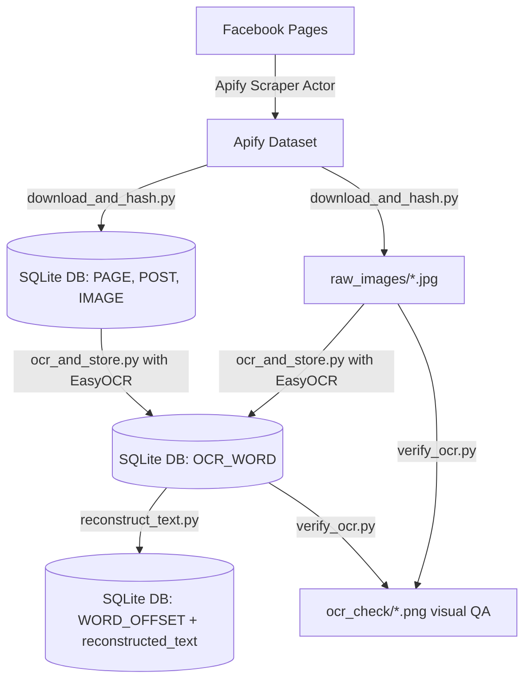
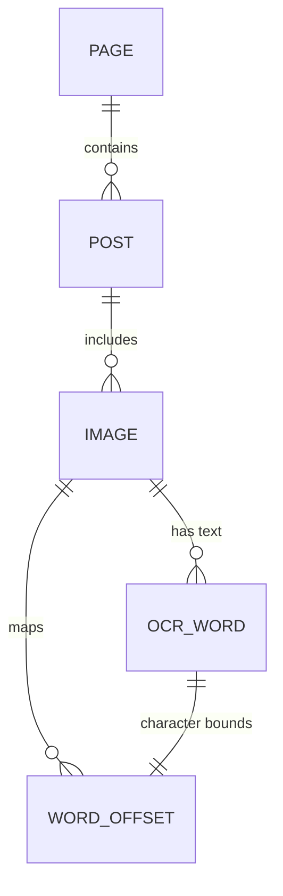
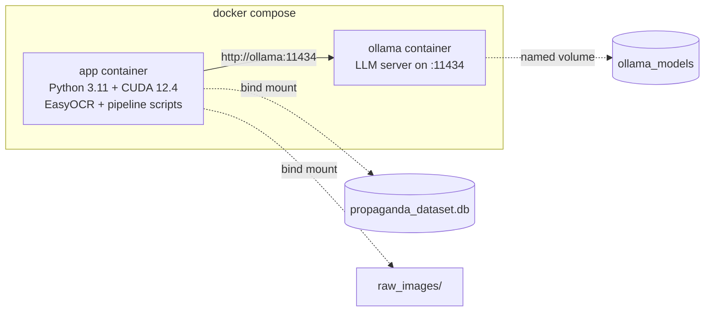

# Bangla Meme Propaganda Dataset — Setup & Pipeline Guide

End-to-end pipeline for scraping, downloading, OCR-ing, and preparing Bangla propaganda memes for annotation. Covers **Layers 1–3** of the dataset build:

| Layer | What it does | Script | Output / Destination |
|---|---|---|---|
| **Layer 1** | Scrape Facebook pages/posts via Apify | *(Apify actor, no local script)* | Apify Cloud Dataset |
| **Layer 2** | Download images + compute exact & perceptual hashes | `download_and_hash.py` | `raw_images/`, tables: `PAGE`, `POST`, `IMAGE` |
| **Layer 3** | OCR every image with EasyOCR (Bangla + English) | `ocr_and_store.py` | table: `OCR_WORD` |
| **Layer 3+** | Reading-order text reconstruction + character offsets | `reconstruct_text.py` | `IMAGE.reconstructed_text`, table: `WORD_OFFSET` |
| **QA** | Visual OCR verification & spot-check | `verify_ocr.py` | `ocr_check/*.png` |

---

## Project Structure

```
meme_propaganda_dataset/
├── .env                    ← APIFY_TOKEN (keep secret, never commit)
├── .gitignore              ← ignores .env, raw_images/, ocr_check/, .venv/, *.db
├── requirements.txt        ← project dependencies
├── download_and_hash.py    ← Layer 2: downloads images, builds PAGE, POST, IMAGE tables
├── ocr_and_store.py        ← Layer 3: EasyOCR (bn + en) with grapheme-aware word splitting
├── reconstruct_text.py     ← Layer 3+: sorts words into reading order & records char offsets
├── verify_ocr.py           ← QA tool: draws line boxes (red) & word boxes (green/orange)
├── propaganda_dataset.db   ← SQLite database storing all metadata, boxes, and offsets
├── raw_images/             ← local directory storing downloaded meme images (.jpg)
└── ocr_check/              ← QA directory with annotated sample images for inspection
```

---

## 1. Prerequisites

- **Python 3.9+** (64-bit recommended)
- **Apify Account** — [apify.com](https://apify.com) (free tier is sufficient to start)
- **NVIDIA GPU (Strongly Recommended for OCR)**:
  - EasyOCR on CPU takes ~3–8 seconds per image.
  - EasyOCR on GPU (CUDA) takes <0.3–0.8 seconds per image (~10–20× faster).
  - Compatible with NVIDIA GTX/RTX cards (e.g., RTX 3050, 3060, 4060, etc.).

---

## 2. Dependencies & GPU Setup (PyTorch + CUDA)

> [!IMPORTANT]
> A standard `pip install easyocr` automatically installs the **CPU-only** version of PyTorch.
> To utilize your NVIDIA GPU, you **must install CUDA-enabled PyTorch first** inside your virtual environment before installing EasyOCR.

### Step 1: Create & Activate Virtual Environment (`.venv`)

Isolate your project dependencies by creating a Python virtual environment:

**Create virtual environment:**
```bash
python -m venv .venv
```

**Activate virtual environment:**
- **Windows (PowerShell):**
  ```powershell
  .venv\Scripts\Activate.ps1
  ```
  *(If you encounter an execution policy restriction, run once: `Set-ExecutionPolicy -ExecutionPolicy RemoteSigned -Scope CurrentUser`)*

- **Windows (Command Prompt / CMD):**
  ```cmd
  .venv\Scripts\activate.bat
  ```

- **macOS / Linux:**
  ```bash
  source .venv/bin/activate
  ```

*(When active, `(.venv)` will appear at the front of your terminal prompt. To exit anytime, run `deactivate`).*

### Step 2: Check your NVIDIA Driver & CUDA version

Open PowerShell or Command Prompt:
```bash
nvidia-smi
```
Look at the top-right corner for `CUDA Version` (e.g., `12.7`, `12.4`, `12.1`, or `11.8`).
*(Note: Your NVIDIA driver supports any CUDA PyTorch wheel up to that version).*

### Step 3: Install CUDA-enabled PyTorch

Inside your activated `(.venv)`, install the PyTorch build that matches your CUDA toolkit:

**For CUDA 12.4 / 12.6+ (recommended for modern RTX cards, Driver 550+):**
```bash
pip install torch torchvision torchaudio --index-url https://download.pytorch.org/whl/cu124
```

**For CUDA 12.1:**
```bash
pip install torch torchvision torchaudio --index-url https://download.pytorch.org/whl/cu121
```

**For CUDA 11.8:**
```bash
pip install torch torchvision torchaudio --index-url https://download.pytorch.org/whl/cu118
```

### Step 4: Install Remaining Project Dependencies

Install the remaining libraries into `(.venv)`:
```bash
pip install apify-client Pillow imagehash python-dotenv requests regex easyocr
```
*(Or install via `pip install -r requirements.txt` after Step 3).*

### Step 5: Verify GPU Acceleration

Run this one-liner in your terminal inside `(.venv)`:
```bash
python -c "import torch; print('CUDA available:', torch.cuda.is_available()); print('Device:', torch.cuda.get_device_name(0) if torch.cuda.is_available() else 'CPU')"
```

- If it outputs:
  ```
  CUDA available: True
  Device: NVIDIA GeForce RTX 3050 Laptop GPU (or your GPU name)
  ```
  GPU acceleration is ready! EasyOCR will now use GPU tensor operations.
- If it outputs `CUDA available: False`, check the [Troubleshooting](#troubleshooting) section below.

---

## 3. Configuration & Credentials

Create a `.env` file in the project root:
```env
APIFY_TOKEN=your_apify_api_token_here
```

To get your Apify token:
1. Log in to [Apify Console](https://console.apify.com/).
2. Navigate to **Settings** → **Integrations** → copy your **Personal API token**.

---

## 4. Pipeline Execution Walkthrough

Follow these steps sequentially to build and process the dataset.



### Step 4.1: Scrape Posts on Apify (Layer 1)
1. In Apify Console, navigate to **Store** → open the official **Facebook Posts Scraper** (`apify/facebook-posts-scraper`).
2. Provide page URLs and post limit in JSON format:
   ```json
   {
     "startUrls": [
       { "url": "https://www.facebook.com/<target_page_1>" },
       { "url": "https://www.facebook.com/<target_page_2>" }
     ],
     "resultsLimit": 40
   }
   ```
3. Click **Start**. When finished, copy the **Dataset ID** from the URL (`https://api.apify.com/v2/datasets/<DATASET_ID>`).
4. Paste the dataset ID into `download_and_hash.py`:
   ```python
   DATASET_ID = "your_dataset_id_here"
   ```

---

### Step 4.2: Download Images & Store Hashes (Layer 2)
Run the downloader:
```bash
python download_and_hash.py
```

**Actions performed:**
- Fetches scraped posts, captions, and engagement metrics (`likes`, `comments`, `shares`).
- Populates `PAGE` and `POST` tables.
- Downloads non-video images into `raw_images/<image_id>.jpg` (where `image_id` is the MD5 hash of the CDN URL).
- Computes:
  - **`image_hash`**: SHA-256 hash of raw bytes (for exact duplicate detection).
  - **`perceptual_hash`**: pHash (for near-duplicate detection under resizing, compression, or watermarks).
- Preserves `fb_alt_text` (Facebook's auto-generated text) as provenance metadata.

---

### Step 4.3: Extract Text with EasyOCR (Layer 3)
Run the OCR extraction:
```bash
python ocr_and_store.py
```

**Key Features & Bangla Optimizations:**
- Detects text in both **Bangla (`bn`)** and **English (`en`)**.
- Uses GPU automatically when CUDA is enabled.
- **Line vs. Word Detection:** EasyOCR detects text at the line level. `ocr_and_store.py` preserves the true line bounding box (`line_x1`, `line_y1`, `line_x2`, `line_y2`) while calculating word bounding boxes (`x1, y1, x2, y2`).
- **Grapheme Cluster Awareness:** Uses Python's `regex` library (`\X`) instead of raw character `len()`. In Bangla script, matras and conjuncts (যুক্তাক্ষর) consume multiple Unicode codepoints but render as a single on-screen grapheme. Proportional word splitting by grapheme counts avoids bounding box drift.
- **Estimated Flag:** Single-word lines have exact detection boxes (`bbox_is_estimated = 0`). Multi-word lines split proportionally have `bbox_is_estimated = 1`.
- **Safe Re-runs & Migrations:** If an older schema `OCR_WORD` table exists, it is automatically backed up as `OCR_WORD_OLD_V1` rather than deleted.

---

### Step 4.4: Reading-Order Text Reconstruction (Layer 3+)
Bridge OCR results to annotator-ready text:
```bash
python reconstruct_text.py
```

**Actions performed:**
- Orders detected lines top-to-bottom (by `line_y1`) and words left-to-right (by `x1`).
- Joins the text into a clean reading format separated by spaces and newlines.
- Saves the full readable string into `IMAGE.reconstructed_text`.
- Populates the `WORD_OFFSET` table with `(start_char, end_char)` for each `ocr_id`, enabling exact bidirectional mapping:
  $$\text{Annotated Span} \Longleftrightarrow \text{Character Offsets} \Longleftrightarrow \text{OCR\_WORD (Bounding Box)}$$

---

### Step 4.5: Visual OCR Quality Assurance (QA)
Inspect OCR bounding boxes visually:
```bash
python verify_ocr.py
```

Generates annotated sample images in `ocr_check/`:
- 🔴 **Red Bounding Box**: Exact line-level detection region from EasyOCR.
- 🟢 **Green Bounding Box**: Exact single-word detection box (`bbox_is_estimated = 0`).
- 🟠 **Orange Bounding Box**: Proportionally estimated word box (`bbox_is_estimated = 1`).

---

## 5. Database Schema Reference

The database `propaganda_dataset.db` contains 5 core relational tables:



### Table: `PAGE`
| Column | Type | Description |
|---|---|---|
| `page_id` | TEXT (PK) | Facebook page identifier extracted from post URL parameter |
| `page_name` | TEXT | Page title / name |
| `page_url` | TEXT | Direct URL to the Facebook page |

### Table: `POST`
| Column | Type | Description |
|---|---|---|
| `post_id` | TEXT (PK) | Facebook `story_fbid` or hash of permalink |
| `page_id` | TEXT (FK) | References `PAGE(page_id)` |
| `post_url` | TEXT | Canonical URL to the post (provenance) |
| `timestamp` | TEXT | Post publication timestamp |
| `caption` | TEXT | Raw post body text |
| `scraped_at` | TEXT | Timestamp when Apify scraped the item |
| `likes` | INTEGER | Post reaction / like count |
| `comments` | INTEGER | Post comment count |
| `shares` | INTEGER | Post share count |

### Table: `IMAGE`
| Column | Type | Description |
|---|---|---|
| `image_id` | TEXT (PK) | MD5 hash of image URL |
| `post_id` | TEXT (FK) | References `POST(post_id)` |
| `file_path` | TEXT | Path to local image file (e.g. `raw_images/<id>.jpg`) |
| `width` | INTEGER | Image pixel width |
| `height` | INTEGER | Image pixel height |
| `image_hash` | TEXT | SHA-256 checksum of raw image bytes (exact duplicate check) |
| `perceptual_hash` | TEXT | pHash 64-bit hex string (near-duplicate detection) |
| `original_image_url` | TEXT | Original Facebook CDN source URL |
| `fb_alt_text` | TEXT | Facebook automated alt-text metadata |
| `reconstructed_text` | TEXT | Reconstructed reading-order text generated by `reconstruct_text.py` |

### Table: `OCR_WORD`
| Column | Type | Description |
|---|---|---|
| `ocr_id` | INTEGER (PK) | Auto-incrementing primary key |
| `image_id` | TEXT (FK) | References `IMAGE(image_id)` |
| `line_id` | INTEGER | Index of the detected line in the image |
| `word` | TEXT | Recognized word token |
| `confidence` | REAL | Model confidence score (0.0 to 1.0) |
| `x1, y1, x2, y2` | INTEGER | Bounding box coordinates of the word token |
| `line_x1, line_y1, line_x2, line_y2` | INTEGER | Parent line detection bounding box (ground-truth region) |
| `bbox_is_estimated` | INTEGER | `0` = direct detection; `1` = proportional grapheme split estimate |

### Table: `WORD_OFFSET`
| Column | Type | Description |
|---|---|---|
| `ocr_id` | INTEGER (PK, FK) | References `OCR_WORD(ocr_id)` |
| `image_id` | TEXT (FK) | References `IMAGE(image_id)` |
| `start_char` | INTEGER | Zero-based start index in `IMAGE.reconstructed_text` |
| `end_char` | INTEGER | Zero-based end index (exclusive) in `IMAGE.reconstructed_text` |

---

## 6. Verification & Useful Queries

Open the SQLite database using SQLite CLI or DB Browser for SQLite:
```bash
sqlite3 propaganda_dataset.db
```

```sql
-- Check total records across all layers
SELECT
  (SELECT COUNT(*) FROM POST) AS total_posts,
  (SELECT COUNT(*) FROM IMAGE) AS total_images,
  (SELECT COUNT(*) FROM OCR_WORD) AS total_words,
  (SELECT COUNT(DISTINCT image_id) FROM OCR_WORD) AS ocred_images;

-- Sample detected words and confidence
SELECT word, confidence, bbox_is_estimated, x1, y1, x2, y2
FROM OCR_WORD
LIMIT 10;

-- Inspect reconstructed text and character offsets
SELECT i.image_id, i.reconstructed_text, w.word, o.start_char, o.end_char
FROM IMAGE i
JOIN WORD_OFFSET o ON i.image_id = o.image_id
JOIN OCR_WORD w ON o.ocr_id = w.ocr_id
WHERE i.reconstructed_text IS NOT NULL
LIMIT 10;
```

---

## 7. Troubleshooting & FAQ

### 1. `CUDA available: False` after installing PyTorch
- **Cause**: PyTorch was installed from PyPI default index (which is CPU-only), or was installed outside the active virtual environment (`.venv`).
- **Fix**: Reinstall PyTorch with the explicit CUDA wheel index:
  ```bash
  pip uninstall -y torch torchvision torchaudio
  pip install torch torchvision torchaudio --index-url https://download.pytorch.org/whl/cu124
  ```

### 2. `CUDA out of memory` during OCR
- **Cause**: Large image dimensions or high batch sizes.
- **Fix**: EasyOCR processes images one at a time by default. If your GPU has limited VRAM (e.g., 4GB), ensure no other heavy GPU processes are running (check `nvidia-smi`). You can also resize oversized images before inference.

### 3. Missing text or over-merged boxes in OCR
- Adjust the detection thresholds in `ocr_and_store.py`:
  ```python
  DETECT_KWARGS = dict(width_ths=0.4, height_ths=0.4, slope_ths=0.1)
  ```
  - Lower `width_ths`: Less horizontal merging (creates finer word/segment boxes).
  - Higher `width_ths`: More aggressive line merging.
  - Test variations with `verify_ocr.py` on `ocr_check/`.

### 4. `sqlite3.OperationalError: no such column`
- If you ran an older version of the script, your database schema may be missing new columns (e.g. `reconstructed_text`).
- In `ocr_and_store.py`, legacy tables are safely backed up automatically.
- For `IMAGE.reconstructed_text`, `reconstruct_text.py` automatically runs `ALTER TABLE IMAGE ADD COLUMN reconstructed_text TEXT` if missing.

---

## 8. Docker Setup (Recommended for Team Collaboration)

Docker provides a fully reproducible environment — no manual CUDA, PyTorch, or Ollama installation required. One command gets everything running.

### Prerequisites

- **Docker Desktop** (Windows/Mac) or **Docker Engine** (Linux) — [Install Docker](https://docs.docker.com/get-docker/)
- **NVIDIA Container Toolkit** (for GPU acceleration) — [Install Guide](https://docs.nvidia.com/datacenter/cloud-native/container-toolkit/latest/install-guide.html)
  - Requires an NVIDIA GPU driver already installed on the host
  - **Not needed** for CPU-only mode

### Quick Start (GPU)

```bash
# 1. Clone and configure
git clone <repo-url>
cd meme_propaganda_dataset
cp .env.example .env          # fill in your APIFY_TOKEN

# 2. Start both containers (app + Ollama)
docker compose up -d --build

# 3. Pull an LLM model (one-time)
docker compose exec ollama ollama pull qwen2.5:3b

# 4. Verify GPU is available
docker compose exec app python -c "import torch; print('CUDA:', torch.cuda.is_available())"

# 5. Run pipeline steps
docker compose exec app python download_and_hash.py
docker compose exec app python ocr_and_store.py
docker compose exec app python reconstruct_text.py
docker compose exec app python annotate_ollama.py --auto
docker compose exec app python view_results.py --summary
```

### Quick Start (CPU-Only — No NVIDIA GPU)

For teammates on Mac, AMD, or Intel-only machines:

```bash
docker compose -f docker-compose.yml -f docker-compose.cpu.yml up -d --build
```

Everything works the same, just slower:
- EasyOCR: ~3–8s per image (vs <0.8s on GPU)
- Ollama: CPU inference (functional but slower)

### Makefile Shortcuts

If `make` is available, use these shortcuts instead of typing full `docker compose exec` commands:

| Command | Action |
|---|---|
| `make up` | Start containers (GPU) |
| `make up-cpu` | Start containers (CPU-only) |
| `make download` | Run Layer 2: download images |
| `make ocr` | Run Layer 3: EasyOCR extraction |
| `make reconstruct` | Run Layer 3+: reading-order reconstruction |
| `make verify` | Run QA: visual OCR check |
| `make annotate` | Run LLM pre-annotation (auto hardware detect) |
| `make results` | View annotation summary |
| `make pull-model MODEL=qwen2.5:7b` | Pull an Ollama model |
| `make gpu-check` | Verify GPU is accessible |
| `make shell` | Open bash shell in app container |
| `make down` | Stop all containers |

### Docker Architecture



### Docker Troubleshooting

#### `docker compose up` fails with GPU error
- **Cause**: NVIDIA Container Toolkit not installed, or GPU driver too old.
- **Fix**: Install the toolkit: `sudo apt install nvidia-container-toolkit` (Linux) or ensure Docker Desktop has GPU support enabled (Windows).
- **Workaround**: Use CPU-only mode: `docker compose -f docker-compose.yml -f docker-compose.cpu.yml up -d --build`

#### Ollama model downloads are slow
- Models are stored in a named Docker volume (`meme_ollama_models`). They persist across container restarts and rebuilds — you only download once.

#### Changes to Python scripts aren't reflected
- Code is **bind-mounted** from your host into the container. Edits are live — no rebuild needed. If you change `requirements.txt`, rebuild with: `docker compose up -d --build`

---

## 9. Next Steps (Annotation & Modeling)

- **Annotation via Label Studio**: Use `reconstructed_text` for span-level propaganda annotation. Spans link back to `WORD_OFFSET` $\rightarrow$ `OCR_WORD` bounding boxes.
- **Multimodal GNNs / Transformers**: Leverage `OCR_WORD` coordinates and image crops for layout-aware multimodal propaganda detection.