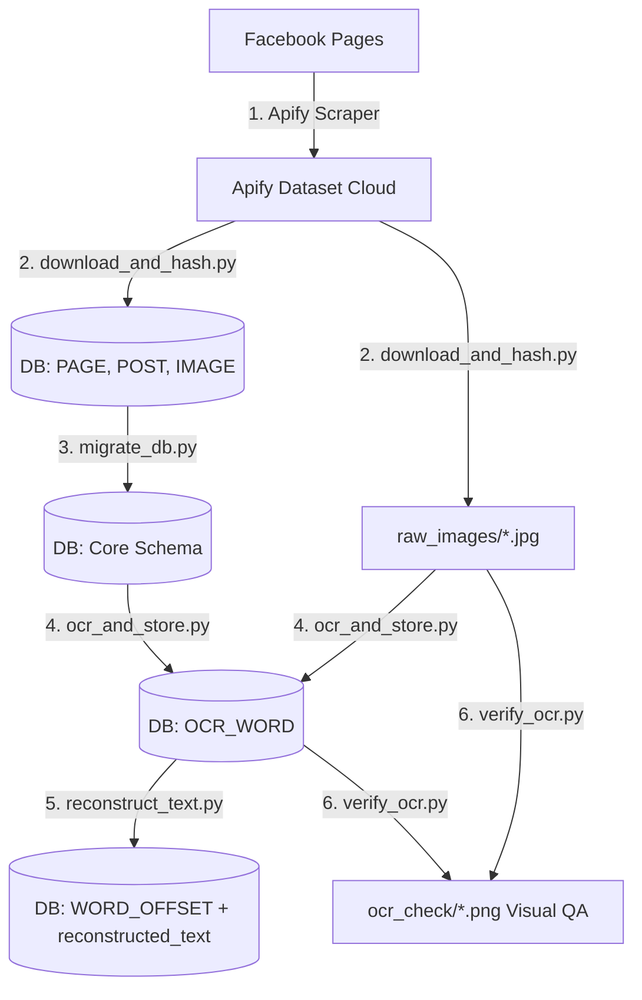
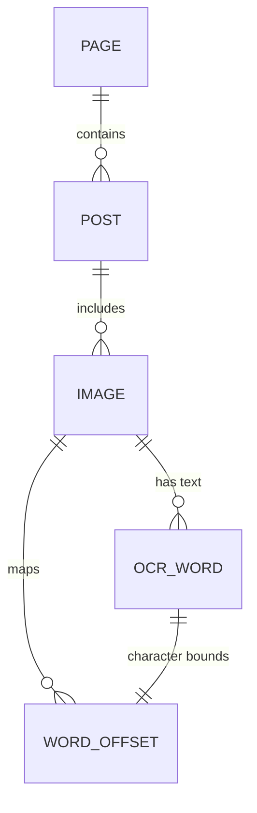

# Bangla Meme Propaganda Dataset

Pipeline for scraping, downloading, database storage, OCR extraction, and text reconstruction for Bangla propaganda memes.

---

## Table of Contents
1. [Overview & Architecture](#1-overview--architecture)
2. [Project Structure](#2-project-structure)
3. [Environment Setup](#3-environment-setup)
   - [Option A: Docker Setup (Recommended)](#option-a-docker-setup-recommended)
   - [Option B: Bare-Metal Setup (Local Python)](#option-b-bare-metal-setup-local-python)
4. [Step-by-Step Pipeline](#4-step-by-step-pipeline)
   - [Step 1: Scrape Facebook Posts (Layer 1)](#step-1-scrape-facebook-posts-layer-1)
   - [Step 2: Download Images & Compute Hashes (Layer 2)](#step-2-download-images--compute-hashes-layer-2)
   - [Step 3: Database Schema Migration & Verification](#step-3-database-schema-migration--verification)
   - [Step 4: Extract Text with EasyOCR (Layer 3)](#step-4-extract-text-with-easyocr-layer-3)
   - [Step 5: Reconstruct Reading-Order Text (Layer 3+)](#step-5-reconstruct-reading-order-text-layer-3)
   - [Step 6: Visual OCR Quality Assurance (QA)](#step-6-visual-ocr-quality-assurance-qa)
5. [Database Schema Reference](#5-database-schema-reference)
6. [Script Reference](#6-script-reference)
7. [Verification & Useful SQL Queries](#7-verification--useful-sql-queries)
8. [Troubleshooting & FAQ](#8-troubleshooting--faq)

---

## 1. Overview & Architecture

The pipeline processes raw Facebook posts and memes into high-quality multimodal dataset layers with bounding boxes and character-level text offsets:



| Layer | Purpose | Script / Tool | Output |
|---|---|---|---|
| **Layer 1** | Scrape Facebook meme pages/posts | Apify Browser Console | Apify Dataset (`DATASET_ID`) |
| **Layer 2** | Download images + compute SHA-256 & pHash | `download_and_hash.py` | `raw_images/`, tables: `PAGE`, `POST`, `IMAGE` |
| **DB Setup** | Database schema verification | `migrate_db.py` | Validated table schemas |
| **Layer 3** | EasyOCR text extraction (Bangla + English) | `ocr_and_store.py` | table: `OCR_WORD` |
| **Layer 3+** | Reading-order text reconstruction & char offsets | `reconstruct_text.py` | `IMAGE.reconstructed_text`, table: `WORD_OFFSET` |
| **QA** | Visual OCR bounding box spot-check | `verify_ocr.py` | `ocr_check/*.png` |

---

## 2. Project Structure

```
meme_propaganda_dataset/
├── readme.md                      ← Documentation
├── .env                           ← Secrets: APIFY_TOKEN, DATASET_ID (never commit)
├── .env.example                   ← Template — copy to .env and fill in values
├── .gitignore
├── requirements.txt               ← Python dependencies
│
├── docker/                        ← All Docker-related files
│   ├── Dockerfile                 ← CUDA 12.4 + Python 3.11 + GPU PyTorch
│   ├── docker-compose.yml         ← Pipeline container with GPU passthrough
│   ├── .dockerignore
│   └── Makefile                   ← Shortcuts: make up, make ocr, etc.
│
├── ── Pipeline Scripts ──────────── (run in order)
├── download_and_hash.py           ← Step 2: Download images & compute hashes
├── migrate_db.py                  ← Step 3: Verify core schema in DB
├── ocr_and_store.py               ← Step 4: EasyOCR extraction (Bangla + English)
├── reconstruct_text.py            ← Step 5: Reading-order text & character offsets
├── verify_ocr.py                  ← Step 6: Visual QA bounding box check
│
├── utils/                         ← Helper/utility scripts
│   └── propaganda_dataset_inspect.py  ← Print DB tables, schemas, row counts
│
├── docs/                          ← Documentation & research plans
│   └── multimodal_bangla_propaganda_dataset_plan.md ← Dataset architecture plan
│
└── ── Generated Data (Gitignored) ──
    ├── propaganda_dataset.db      ← SQLite DB (metadata & OCR)
    ├── raw_images/                ← Downloaded meme images (.jpg)
    └── ocr_check/                 ← QA bounding-box annotated images (.png)
```

---

## 3. Environment Setup

Choose **Option A** (Docker) or **Option B** (Bare-Metal).

---

### Option A: Docker Setup (Recommended)

Docker provides an isolated container with CUDA 12.4 and GPU PyTorch pre-configured for EasyOCR.

#### 1. Clone & Configure Environment
```bash
git clone https://github.com/AbMehedi/meme_propaganda_dataset.git
cd meme_propaganda_dataset
cp .env.example .env
```

Open `.env` and fill in your values:
```env
APIFY_TOKEN=your_apify_token_here
DATASET_ID=your_apify_dataset_id_here
```

#### 2. Start Containers
```bash
docker compose -f docker/docker-compose.yml up -d --build
```

#### 3. Verify Container GPU Access
```bash
docker compose -f docker/docker-compose.yml exec app python -c "import torch; print('CUDA:', torch.cuda.is_available()); print('Device:', torch.cuda.get_device_name(0) if torch.cuda.is_available() else 'CPU')"
```

---

### Option B: Bare-Metal Setup (Local Python)

Run directly on your host operating system (Windows/Linux/macOS).

#### 1. Clone & Configure Environment
```bash
git clone https://github.com/AbMehedi/meme_propaganda_dataset.git
cd meme_propaganda_dataset
cp .env.example .env
```

Open `.env` and fill in your values:
```env
APIFY_TOKEN=your_apify_token_here
DATASET_ID=your_apify_dataset_id_here
```

#### 2. Create & Activate Virtual Environment
```bash
python -m venv .venv
```

- **Windows (PowerShell):**
  ```powershell
  .venv\Scripts\Activate.ps1
  ```
- **Windows (CMD):**
  ```cmd
  .venv\Scripts\activate.bat
  ```
- **Linux / macOS:**
  ```bash
  source .venv/bin/activate
  ```

#### 3. Install CUDA-Enabled PyTorch First
Check your CUDA driver version using `nvidia-smi`, then install the matching wheel:

- **CUDA 12.4+ (RTX 30xx/40xx):**
  ```bash
  pip install torch torchvision torchaudio --index-url https://download.pytorch.org/whl/cu124
  ```
- **CPU-Only (No NVIDIA GPU):**
  ```bash
  pip install torch torchvision torchaudio
  ```

#### 4. Install Project Requirements
```bash
pip install -r requirements.txt
```

#### 5. Verify GPU Acceleration
```bash
python -c "import torch; print('CUDA available:', torch.cuda.is_available()); print('Device:', torch.cuda.get_device_name(0) if torch.cuda.is_available() else 'CPU')"
```

---

## 4. Step-by-Step Pipeline

Execute these steps in order to build and process the dataset from scratch.

---

### Step 1: Scrape Facebook Posts (Layer 1)

*This step runs in your web browser via Apify Console.*

1. Log in to [Apify Console](https://console.apify.com/).
2. Go to **Store** → Select **Facebook Posts Scraper** (`apify/facebook-posts-scraper`).
3. Enter target Facebook page URLs and post limit.
4. Click **Start**. Once completed, copy the **Dataset ID** from the dataset URL:
   `https://api.apify.com/v2/datasets/<DATASET_ID>`
5. Add your token and dataset ID to `.env`:
   ```env
   APIFY_TOKEN=your_apify_api_token
   DATASET_ID=your_dataset_id_here
   ```

---

### Step 2: Download Images & Compute Hashes (Layer 2)

Fetches post metadata and downloads images locally. Computes SHA-256 (exact duplicate check) and pHash (perceptual near-duplicate check).

| Environment | Command |
|---|---|
| **Docker** | `docker compose -f docker/docker-compose.yml exec app python download_and_hash.py` |
| **Bare-Metal** | `python download_and_hash.py` |

- **Output:** Populates `PAGE`, `POST`, and `IMAGE` tables in `propaganda_dataset.db`, and saves images into `raw_images/<image_id>.jpg`.

---

### Step 3: Database Schema Migration & Verification

Ensures all core tables (`PAGE`, `POST`, `IMAGE`, `OCR_WORD`, `WORD_OFFSET`) exist in `propaganda_dataset.db`.

| Environment | Command |
|---|---|
| **Docker** | `docker compose -f docker/docker-compose.yml exec app python migrate_db.py` |
| **Bare-Metal** | `python migrate_db.py` |

Optional flag:
- `--drop-annotation-tables`: drops legacy `ANNOTATION` and `LLM_PREANNOTATION` tables if present.

---

### Step 4: Extract Text with EasyOCR (Layer 3)

Runs EasyOCR for Bangla (`bn`) and English (`en`) with contrast enhancement (CLAHE), bilateral denoising, and Unicode grapheme cluster splitting (`\X`) to prevent bounding box drift on conjuncts (যুক্তাক্ষর).

| Environment | Command |
|---|---|
| **Docker** | `docker compose -f docker/docker-compose.yml exec app python ocr_and_store.py` |
| **Bare-Metal** | `python ocr_and_store.py` |

- **Output:** Populates the `OCR_WORD` table with word tokens, confidence scores, and bounding boxes (`x1, y1, x2, y2`, `line_x1, line_y1, line_x2, line_y2`).

---

### Step 5: Reconstruct Reading-Order Text (Layer 3+)

Sorts detected words into natural reading order (top-to-bottom, left-to-right), builds a readable string per image, and maps character offsets.

| Environment | Command |
|---|---|
| **Docker** | `docker compose -f docker/docker-compose.yml exec app python reconstruct_text.py` |
| **Bare-Metal** | `python reconstruct_text.py` |

- **Output:** Updates `IMAGE.reconstructed_text` and populates `WORD_OFFSET (ocr_id, image_id, start_char, end_char)`.

---

### Step 6: Visual OCR Quality Assurance (QA)

Draws line bounding boxes (🔴 Red), exact word boxes (🟢 Green), and estimated word boxes (🟠 Orange) onto images for quality spot-checks.

| Environment | Command |
|---|---|
| **Docker** | `docker compose -f docker/docker-compose.yml exec app python verify_ocr.py` |
| **Bare-Metal** | `python verify_ocr.py` |

- **Output:** Saves annotated verification images in `ocr_check/*.png`. Open and inspect sample images visually.

---

## 5. Database Schema Reference

The database `propaganda_dataset.db` contains 5 core relational tables:



### Table: `PAGE`
| Column | Type | Description |
|---|---|---|
| `page_id` | TEXT (PK) | Facebook page identifier |
| `page_name` | TEXT | Facebook page name / title |
| `page_url` | TEXT | Canonical page URL |

### Table: `POST`
| Column | Type | Description |
|---|---|---|
| `post_id` | TEXT (PK) | Facebook `story_fbid` or hash of permalink |
| `page_id` | TEXT (FK) | Reference to `PAGE(page_id)` |
| `post_url` | TEXT | Permalink to post |
| `timestamp` | TEXT | Post publication timestamp |
| `caption` | TEXT | Post body text |
| `scraped_at` | TEXT | Scrape timestamp |
| `likes` | INTEGER | Like reaction count |
| `comments` | INTEGER | Comment count |
| `shares` | INTEGER | Share count |

### Table: `IMAGE`
| Column | Type | Description |
|---|---|---|
| `image_id` | TEXT (PK) | MD5 hash of image source URL |
| `post_id` | TEXT (FK) | Reference to `POST(post_id)` |
| `file_path` | TEXT | Local file path (`raw_images/<id>.jpg`) |
| `width` / `height` | INTEGER | Dimensions in pixels |
| `image_hash` | TEXT | SHA-256 hash of raw bytes (exact duplicates) |
| `perceptual_hash` | TEXT | 64-bit pHash hex string (near duplicates) |
| `original_image_url` | TEXT | Facebook CDN source URL |
| `fb_alt_text` | TEXT | Automated Facebook alt-text |
| `reconstructed_text` | TEXT | Reading-order text created by `reconstruct_text.py` |

### Table: `OCR_WORD`
| Column | Type | Description |
|---|---|---|
| `ocr_id` | INTEGER (PK) | Auto-incrementing identifier |
| `image_id` | TEXT (FK) | Reference to `IMAGE(image_id)` |
| `line_id` | INTEGER | Line index within image |
| `word` | TEXT | Recognized word token |
| `confidence` | REAL | Confidence score (0.0 to 1.0) |
| `x1, y1, x2, y2` | INTEGER | Word bounding box coordinates |
| `line_x1, line_y1, line_x2, line_y2` | INTEGER | Parent line detection bounding box |
| `bbox_is_estimated` | INTEGER | `0` = direct detection, `1` = proportional grapheme split |

### Table: `WORD_OFFSET`
| Column | Type | Description |
|---|---|---|
| `ocr_id` | INTEGER (PK, FK) | Reference to `OCR_WORD(ocr_id)` |
| `image_id` | TEXT (FK) | Reference to `IMAGE(image_id)` |
| `start_char` | INTEGER | Start index in `IMAGE.reconstructed_text` |
| `end_char` | INTEGER | End index (exclusive) in `IMAGE.reconstructed_text` |

---

## 6. Script Reference

| Script | Command / Flags | Description |
|---|---|---|
| `download_and_hash.py` | `python download_and_hash.py` | Downloads images and generates database entries from `DATASET_ID` |
| `migrate_db.py` | `python migrate_db.py` | Ensures all core tables exist in `propaganda_dataset.db` |
| | `--drop-annotation-tables` | Cleans legacy annotation tables |
| `ocr_and_store.py` | `python ocr_and_store.py` | Performs EasyOCR on all unprocessed images in `IMAGE` |
| `reconstruct_text.py` | `python reconstruct_text.py` | Assembles words into natural reading order and populates `WORD_OFFSET` |
| `verify_ocr.py` | `python verify_ocr.py` | Generates sample visual bounding boxes in `ocr_check/` |
| `utils/propaganda_dataset_inspect.py` | `python utils/propaganda_dataset_inspect.py` | Summary of table schemas and row counts |

---

## 7. Verification & Useful SQL Queries

You can inspect the database at any time using SQLite:
```bash
sqlite3 propaganda_dataset.db
```

Or with the built-in python script:
```bash
python utils/propaganda_dataset_inspect.py
```

### Useful SQL Queries
```sql
-- 1. Check counts across all tables
SELECT
  (SELECT COUNT(*) FROM PAGE) AS pages,
  (SELECT COUNT(*) FROM POST) AS posts,
  (SELECT COUNT(*) FROM IMAGE) AS images,
  (SELECT COUNT(*) FROM OCR_WORD) AS ocr_words,
  (SELECT COUNT(DISTINCT image_id) FROM OCR_WORD) AS ocred_images;

-- 2. Inspect reconstructed text and character offsets
SELECT i.image_id, i.reconstructed_text, w.word, o.start_char, o.end_char
FROM IMAGE i
JOIN WORD_OFFSET o ON i.image_id = o.image_id
JOIN OCR_WORD w ON o.ocr_id = w.ocr_id
WHERE i.reconstructed_text IS NOT NULL
LIMIT 10;
```

---

## 8. Troubleshooting & FAQ

### 1. `CUDA available: False`
- **Cause:** PyTorch was installed from standard PyPI (CPU version).
- **Fix:** Inside your `.venv`, reinstall with explicit CUDA wheel:
  ```bash
  pip uninstall -y torch torchvision torchaudio
  pip install torch torchvision torchaudio --index-url https://download.pytorch.org/whl/cu124
  ```

### 2. Missing `APIFY_TOKEN` or `DATASET_ID` Error
- **Cause:** `.env` file is missing or variables are unset.
- **Fix:** Make sure `.env` contains:
  ```env
  APIFY_TOKEN=your_token
  DATASET_ID=your_dataset_id
  ```

### 3. `sqlite3.OperationalError: no such column`
- **Cause:** Schema migration is missing.
- **Fix:** Run:
  ```bash
  python migrate_db.py
  python reconstruct_text.py
  ```

### 4. `'make' is not recognized as an internal or external command`
- **Cause:** Standard Windows PowerShell does not ship with GNU `make`.
- **Fix:** Run direct `docker compose` or Python commands instead of `make`.
