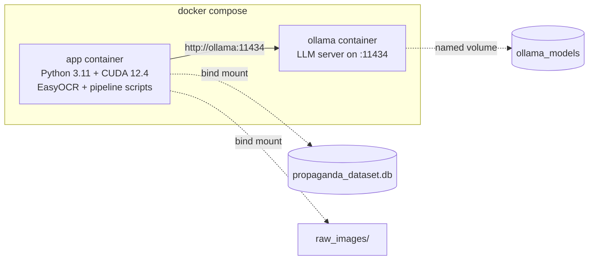
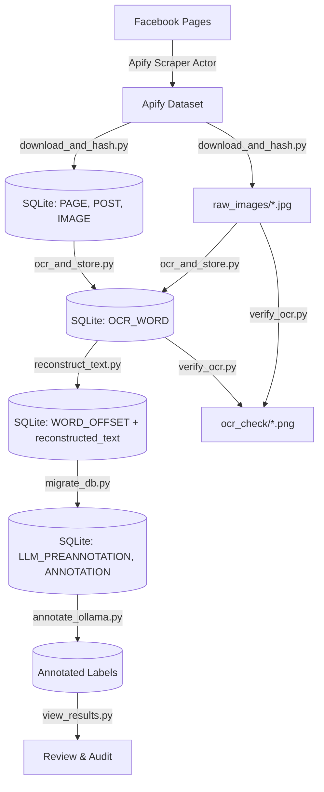
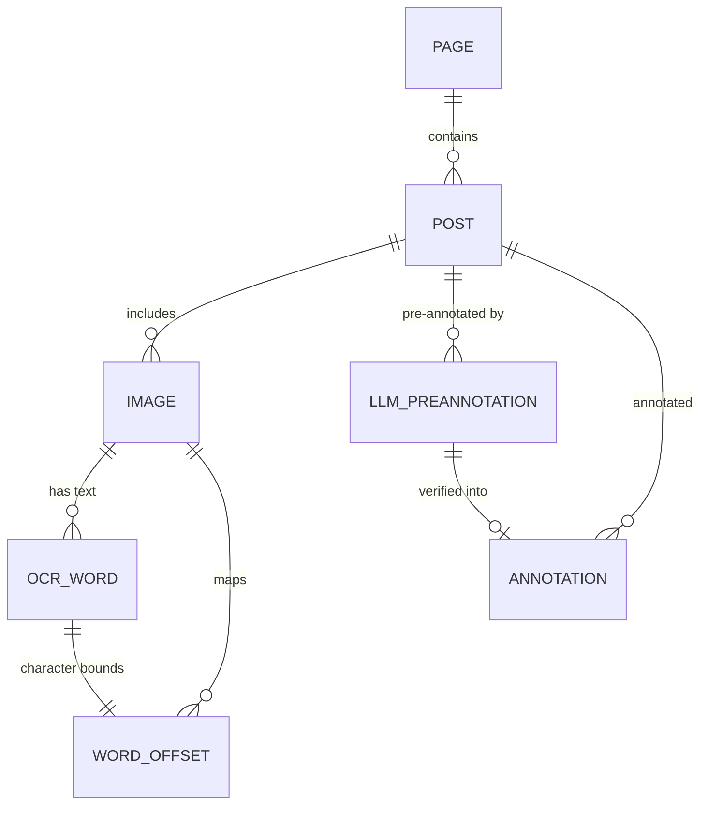

# Bangla Meme Propaganda Dataset

End-to-end pipeline for scraping, downloading, OCR-ing, annotating, and preparing Bangla propaganda memes for multimodal analysis. Covers dataset collection through LLM-assisted annotation.

---

## Quick Start (Docker — 5 Commands)

```bash
git clone https://github.com/AbMehedi/meme_propaganda_dataset.git
cd meme_propaganda_dataset
cp .env.example .env                  # fill in APIFY_TOKEN
docker compose up -d --build          # start app + Ollama containers
docker compose exec app python ocr_and_store.py   # run any pipeline step
```

> [!TIP]
> If you don't have Docker or prefer a manual setup, see [Path B: Bare-Metal Setup](#path-b-bare-metal-setup-manual).

---

## Pipeline Overview

| Layer | What it does | Script | Output |
|---|---|---|---|
| **Layer 1** | Scrape Facebook pages/posts via Apify | *(Apify Console — browser)* | Apify Cloud Dataset |
| **Layer 2** | Download images + compute exact & perceptual hashes | `download_and_hash.py` | `raw_images/`, tables: `PAGE`, `POST`, `IMAGE` |
| **Layer 3** | OCR every image with EasyOCR (Bangla + English) | `ocr_and_store.py` | table: `OCR_WORD` |
| **Layer 3+** | Reading-order text reconstruction + character offsets | `reconstruct_text.py` | `IMAGE.reconstructed_text`, table: `WORD_OFFSET` |
| **QA** | Visual OCR verification & spot-check | `verify_ocr.py` | `ocr_check/*.png` |
| **Layer 4** | LLM pre-annotation with propaganda taxonomy | `migrate_db.py` → `annotate_ollama.py` | tables: `LLM_PREANNOTATION`, `ANNOTATION` |
| **Review** | View & audit annotation results | `view_results.py` | Terminal output |

---

## Project Structure

```
meme_propaganda_dataset/
│
├── .env                           ← APIFY_TOKEN (keep secret, never commit)
├── .env.example                   ← Template for teammates — copy to .env
├── .gitignore                     ← Ignores .env, raw_images/, .venv/, *.db
├── requirements.txt               ← Python dependencies
│
├── ── Docker ──────────────────────
├── Dockerfile                     ← CUDA 12.4 + Python 3.11 + GPU PyTorch
├── docker-compose.yml             ← Two services: app + Ollama (GPU)
├── docker-compose.cpu.yml         ← CPU-only override (no NVIDIA GPU)
├── .dockerignore                  ← Keeps Docker build context small
├── Makefile                       ← Convenience shortcuts (make ocr, make annotate, etc.)
│
├── ── Pipeline Scripts ────────────
├── download_and_hash.py           ← Layer 2: download images, build PAGE/POST/IMAGE tables
├── ocr_and_store.py               ← Layer 3: EasyOCR (bn+en) with grapheme-aware word splitting
├── reconstruct_text.py            ← Layer 3+: sort words into reading order, record char offsets
├── verify_ocr.py                  ← QA: draw line boxes (red) & word boxes (green/orange)
├── migrate_db.py                  ← Add LLM_PREANNOTATION & ANNOTATION tables to DB
├── annotate_ollama.py             ← Layer 4: Ollama LLM pre-annotation with hardware auto-detect
├── view_results.py                ← Review annotation results, summary, and review queue
├── propaganda_dataset_inspect.py  ← Utility: print all tables, schemas, and row counts
│
├── ── Documentation ───────────────
├── readme.md                      ← This file
├── bangla_meme_propaganda_codebook.md       ← Strict annotation codebook (8 techniques)
├── hitl_llm_human_annotation_workflow.md    ← HITL annotation workflow design
├── gpt_prompt_design_guide.md               ← Prompt engineering guide for annotation
├── multimodal_bangla_propaganda_dataset_plan.md ← Full dataset construction plan
│
├── ── Data (gitignored) ───────────
├── propaganda_dataset.db          ← SQLite database (all metadata, OCR, annotations)
├── raw_images/                    ← Downloaded meme images (.jpg)
└── ocr_check/                     ← QA annotated images (.png)
```

---

## Setup — Choose Your Path

### Path A: Docker Setup (Recommended)

Docker gives your teammate a fully reproducible environment — no manual CUDA, PyTorch, or Ollama installation.

#### Prerequisites

- **Docker Desktop** (Windows/Mac) or **Docker Engine** (Linux) — [Install Docker](https://docs.docker.com/get-docker/)
- **NVIDIA Container Toolkit** (for GPU acceleration) — [Install Guide](https://docs.nvidia.com/datacenter/cloud-native/container-toolkit/latest/install-guide.html)
  - Requires an NVIDIA GPU driver already installed on the host
  - **Not needed** for CPU-only mode (see below)

#### Step 1: Clone & Configure

```bash
git clone https://github.com/AbMehedi/meme_propaganda_dataset.git
cd meme_propaganda_dataset
cp .env.example .env
```

Open `.env` and fill in your Apify token:
```env
APIFY_TOKEN=your_apify_api_token_here
```

#### Step 2: Start Containers (GPU)

```bash
docker compose up -d --build
```

This starts two containers:



**CPU-Only (no NVIDIA GPU)?** Use this instead:
```bash
docker compose -f docker-compose.yml -f docker-compose.cpu.yml up -d --build
```
Everything works the same, just slower (EasyOCR: ~3–8s/image vs <0.8s on GPU).

#### Step 3: Verify GPU

```bash
docker compose exec app python -c "import torch; print('CUDA:', torch.cuda.is_available()); print('Device:', torch.cuda.get_device_name(0) if torch.cuda.is_available() else 'CPU')"
```

Expected output:
```
CUDA: True
Device: NVIDIA GeForce RTX 3050 Laptop GPU
```

#### Step 4: Pull an LLM Model (One-Time)

```bash
docker compose exec ollama ollama pull qwen2.5:3b
```

#### Running Pipeline Steps (Docker)

All pipeline commands use `docker compose exec app python <script>`:

```bash
docker compose exec app python download_and_hash.py
docker compose exec app python ocr_and_store.py
docker compose exec app python reconstruct_text.py
docker compose exec app python verify_ocr.py
docker compose exec app python migrate_db.py
docker compose exec app python annotate_ollama.py --auto
docker compose exec app python view_results.py --summary
```

#### Makefile Shortcuts

If `make` is available, use these shortcuts instead:

| Command | Action |
|---|---|
| `make up` | Start containers (GPU) |
| `make up-cpu` | Start containers (CPU-only) |
| `make download` | Layer 2: download images |
| `make ocr` | Layer 3: EasyOCR extraction |
| `make reconstruct` | Layer 3+: reading-order reconstruction |
| `make verify` | QA: visual OCR check |
| `make annotate` | LLM pre-annotation (auto hardware detect) |
| `make results` | View annotation summary |
| `make pull-model MODEL=qwen2.5:7b` | Pull a specific Ollama model |
| `make gpu-check` | Verify GPU access |
| `make shell` | Open bash shell in app container |
| `make down` | Stop all containers |
| `make logs` | Tail container logs |

#### Stopping Docker

```bash
docker compose down       # stop containers (data persists)
```

> [!NOTE]
> Your code is **bind-mounted** — edits on your host are instantly reflected inside the container. No rebuild needed unless you change `requirements.txt` (`docker compose up -d --build`).

---

### Path B: Bare-Metal Setup (Manual)

For running directly on your machine without Docker.

#### Prerequisites

- **Python 3.9+** (64-bit recommended)
- **Apify Account** — [apify.com](https://apify.com) (free tier is sufficient)
- **Ollama** — [ollama.com/download](https://ollama.com/download) (required for annotation)
- **NVIDIA GPU** (strongly recommended for OCR):
  - EasyOCR on CPU: ~3–8 seconds per image
  - EasyOCR on GPU (CUDA): <0.3–0.8 seconds per image (~10–20× faster)
  - Compatible with NVIDIA GTX/RTX cards (e.g., RTX 3050, 3060, 4060, etc.)

#### Step 1: Clone & Configure

```bash
git clone https://github.com/AbMehedi/meme_propaganda_dataset.git
cd meme_propaganda_dataset
cp .env.example .env
```

Open `.env` and add your Apify token:
```env
APIFY_TOKEN=your_apify_api_token_here
```

To get your token: [Apify Console](https://console.apify.com/) → **Settings** → **Integrations** → copy **Personal API token**.

#### Step 2: Create & Activate Virtual Environment

```bash
python -m venv .venv
```

**Activate:**

| Platform | Command |
|---|---|
| Windows (PowerShell) | `.venv\Scripts\Activate.ps1` |
| Windows (CMD) | `.venv\Scripts\activate.bat` |
| macOS / Linux | `source .venv/bin/activate` |

> [!TIP]
> If PowerShell blocks activation, run once: `Set-ExecutionPolicy -ExecutionPolicy RemoteSigned -Scope CurrentUser`

When active, `(.venv)` appears at the front of your terminal prompt. To exit: `deactivate`.

#### Step 3: Check NVIDIA CUDA Version

```bash
nvidia-smi
```

Look at the top-right corner for `CUDA Version` (e.g., `12.7`, `12.4`, `12.1`, or `11.8`). Your driver supports any CUDA PyTorch wheel up to that version.

#### Step 4: Install CUDA-Enabled PyTorch

> [!IMPORTANT]
> You **must** install CUDA PyTorch **first**, before `pip install -r requirements.txt`. Otherwise `easyocr` pulls CPU-only PyTorch from PyPI.

Inside your activated `(.venv)`, pick the command matching your CUDA version:

**CUDA 12.4 / 12.6+ (recommended — modern RTX cards, Driver 550+):**
```bash
pip install torch torchvision torchaudio --index-url https://download.pytorch.org/whl/cu124
```

**CUDA 12.1:**
```bash
pip install torch torchvision torchaudio --index-url https://download.pytorch.org/whl/cu121
```

**CUDA 11.8:**
```bash
pip install torch torchvision torchaudio --index-url https://download.pytorch.org/whl/cu118
```

**No NVIDIA GPU (CPU only):**
```bash
pip install torch torchvision torchaudio
```

#### Step 5: Install Project Dependencies

```bash
pip install -r requirements.txt
```

#### Step 6: Verify GPU Acceleration

```bash
python -c "import torch; print('CUDA available:', torch.cuda.is_available()); print('Device:', torch.cuda.get_device_name(0) if torch.cuda.is_available() else 'CPU')"
```

Expected (with GPU):
```
CUDA available: True
Device: NVIDIA GeForce RTX 3050 Laptop GPU
```

If it outputs `CUDA available: False`, see [Troubleshooting](#troubleshooting--faq).

#### Step 7: Install & Start Ollama

1. Download from [ollama.com/download](https://ollama.com/download) and install.
2. Open the Ollama app (it runs a local server on `http://localhost:11434`).
3. Pull a model:
   ```bash
   ollama pull qwen2.5:3b
   ```

---

## Pipeline Walkthrough (Step-by-Step)

Follow these steps sequentially to build the dataset from scratch.



### Step 1: Scrape Posts on Apify (Layer 1)

This step runs in the browser, not locally.

1. Log in to [Apify Console](https://console.apify.com/).
2. Navigate to **Store** → open the **Facebook Posts Scraper** (`apify/facebook-posts-scraper`).
3. Provide page URLs and post limit:
   ```json
   {
     "startUrls": [
       { "url": "https://www.facebook.com/<target_page_1>" },
       { "url": "https://www.facebook.com/<target_page_2>" }
     ],
     "resultsLimit": 40
   }
   ```
4. Click **Start**. When finished, copy the **Dataset ID** from the URL:
   `https://api.apify.com/v2/datasets/<DATASET_ID>`
5. Open `download_and_hash.py` and paste the dataset ID:
   ```python
   DATASET_ID = "your_dataset_id_here"
   ```

### Step 2: Download Images & Store Hashes (Layer 2)

| | Command |
|---|---|
| **Docker** | `docker compose exec app python download_and_hash.py` |
| **Bare-metal** | `python download_and_hash.py` |

**What it does:**
- Fetches scraped posts, captions, and engagement metrics (`likes`, `comments`, `shares`)
- Populates `PAGE` and `POST` tables
- Downloads non-video images into `raw_images/<image_id>.jpg` (where `image_id` = MD5 of CDN URL)
- Computes **`image_hash`** (SHA-256 — exact duplicate detection) and **`perceptual_hash`** (pHash — near-duplicate detection under resizing/compression/watermarks)
- Preserves `fb_alt_text` (Facebook's auto-generated text) as provenance metadata

### Step 3: Extract Text with EasyOCR (Layer 3)

| | Command |
|---|---|
| **Docker** | `docker compose exec app python ocr_and_store.py` |
| **Bare-metal** | `python ocr_and_store.py` |

**What it does:**
- Detects text in both **Bangla (`bn`)** and **English (`en`)**
- Uses GPU automatically when CUDA is available
- **Image preprocessing** — upscales low-res memes (<1000px), applies CLAHE contrast enhancement and bilateral denoising
- **Grapheme cluster awareness** — uses `regex` library (`\X`) instead of `len()`. Bangla matras and conjuncts (যুক্তাক্ষর) are multiple codepoints but single on-screen characters. Proportional word splitting by grapheme count avoids bounding box drift
- **Exact vs estimated boxes** — single-word lines get exact boxes (`bbox_is_estimated = 0`), multi-word lines split proportionally (`bbox_is_estimated = 1`)
- **Safe re-runs** — existing `OCR_WORD` tables are backed up as `OCR_WORD_OLD_V1`, not deleted

### Step 4: Reconstruct Reading-Order Text (Layer 3+)

| | Command |
|---|---|
| **Docker** | `docker compose exec app python reconstruct_text.py` |
| **Bare-metal** | `python reconstruct_text.py` |

**What it does:**
- Orders detected lines top-to-bottom (by `line_y1`) and words left-to-right (by `x1`)
- Joins text into a clean reading format separated by spaces and newlines
- Saves the full readable string into `IMAGE.reconstructed_text`
- Populates the `WORD_OFFSET` table with `(start_char, end_char)` for each `ocr_id`, enabling bidirectional mapping:

$$\text{Annotated Span} \Longleftrightarrow \text{Character Offsets} \Longleftrightarrow \text{OCR\_WORD (Bounding Box)}$$

### Step 5: Visual OCR Quality Assurance

| | Command |
|---|---|
| **Docker** | `docker compose exec app python verify_ocr.py` |
| **Bare-metal** | `python verify_ocr.py` |

Generates annotated sample images in `ocr_check/`:
- 🔴 **Red** — line-level detection region from EasyOCR
- 🟢 **Green** — exact single-word detection box (`bbox_is_estimated = 0`)
- 🟠 **Orange** — proportionally estimated word box (`bbox_is_estimated = 1`)

Open the images in `ocr_check/` and visually verify that boxes align with text.

### Step 6: Migrate Database for Annotation (Layer 4)

| | Command |
|---|---|
| **Docker** | `docker compose exec app python migrate_db.py` |
| **Bare-metal** | `python migrate_db.py` |

**What it does:**
- Adds `LLM_PREANNOTATION` and `ANNOTATION` tables to the database
- Safe to run multiple times (uses `CREATE TABLE IF NOT EXISTS`)
- Required before running `annotate_ollama.py`

### Step 7: LLM Pre-Annotation with Ollama

| | Command |
|---|---|
| **Docker** | `docker compose exec app python annotate_ollama.py --auto` |
| **Bare-metal** | `python annotate_ollama.py --auto` |

> [!IMPORTANT]
> **Ollama must be running** before this step. In Docker, Ollama starts automatically. For bare-metal, ensure the Ollama app is open or run `ollama serve`.

**What it does:**
- Auto-detects your hardware (RAM, VRAM, GPU) and selects the best model
- Sends OCR text + caption + alt-text to the LLM with a strict propaganda codebook
- Enforces JSON schema at the token level for structured output
- Stores predictions in `LLM_PREANNOTATION` table

**Propaganda Taxonomy (8 techniques):**

| Code | Technique | Description |
|---|---|---|
| T01 | Loaded Language | Emotionally charged words provoking approval/disapproval |
| T02 | Name Calling / Labeling | TARGET + DEROGATORY LABEL explicitly present |
| T03 | Smears | TARGET + SPECIFIC NEGATIVE CLAIM + REPUTATIONAL DAMAGE |
| T04 | Appeal to Fear/Prejudice | Deliberate THREAT / DANGER / FEAR construction |
| T05 | Exaggeration/Minimisation | Substantial overstatement OR downplay of fact/event |
| T06 | Slogans | Short rallying phrase substituting for reasoning |
| T07 | Appeal to Strong Emotions | Intense NON-FEAR emotion deliberately provoked |
| T08 | No Propaganda Technique | None of T01–T07 apply |

**Hardware tiers (auto-detected):**

| Model | Min VRAM | Min RAM | Best For |
|---|---|---|---|
| `qwen2.5:14b` | 10 GB | 14 GB | Best quality — RTX 10-12GB+ VRAM |
| `qwen2.5:7b` | 5 GB | 7 GB | Good balance — RTX 6-8GB+ VRAM |
| `llava-phi3` | 3.5 GB | 6 GB | Multimodal vision — RTX 4GB+ VRAM |
| `qwen2.5:3b` | 0 GB | 3 GB | Lightweight — CPU-only or low RAM |

**Useful flags:**
```bash
python annotate_ollama.py --auto              # auto-detect hardware, pick best model
python annotate_ollama.py --model qwen2.5:7b  # manually pick a model
python annotate_ollama.py --limit 5           # annotate only 5 posts
python annotate_ollama.py --runs 3            # 3 runs per post (uncertainty scoring)
python annotate_ollama.py --dry-run           # print prompts without calling model
python annotate_ollama.py --info              # show hardware info and exit
```

### Step 8: View & Audit Results

| | Command |
|---|---|
| **Docker** | `docker compose exec app python view_results.py --summary` |
| **Bare-metal** | `python view_results.py --summary` |

**What it does:**
- Displays label distribution, average confidence, and review flags
- **Human review queue** — posts are flagged for human review if:
  1. Model explicitly set `needs_review=true`
  2. Overall confidence < threshold (default: 0.65)
  3. All labels are T08 but substantial OCR text exists (possible miss)
  4. T08 mixed with other labels (codebook violation)

**Useful flags:**
```bash
python view_results.py                        # full per-post detail
python view_results.py --summary              # summary table only
python view_results.py --review-queue         # only posts needing human review
python view_results.py --model qwen2.5:3b     # filter by model
python view_results.py --conf-threshold 0.5   # custom confidence cutoff
```

---

## Database Schema Reference

The database `propaganda_dataset.db` contains 7 relational tables across 4 layers:



### Table: `PAGE`

| Column | Type | Description |
|---|---|---|
| `page_id` | TEXT (PK) | Facebook page identifier extracted from post URL parameter |
| `page_name` | TEXT | Page title / name |
| `page_url` | TEXT | Direct URL to the Facebook page |

### Table: `POST`

| Column | Type | Description |
|---|---|---|
| `post_id` | TEXT (PK) | Facebook `story_fbid` or hash of permalink |
| `page_id` | TEXT (FK) | References `PAGE(page_id)` |
| `post_url` | TEXT | Canonical URL to the post (provenance) |
| `timestamp` | TEXT | Post publication timestamp |
| `caption` | TEXT | Raw post body text |
| `scraped_at` | TEXT | Timestamp when Apify scraped the item |
| `likes` | INTEGER | Post reaction / like count |
| `comments` | INTEGER | Post comment count |
| `shares` | INTEGER | Post share count |

### Table: `IMAGE`

| Column | Type | Description |
|---|---|---|
| `image_id` | TEXT (PK) | MD5 hash of image URL |
| `post_id` | TEXT (FK) | References `POST(post_id)` |
| `file_path` | TEXT | Path to local image file (e.g. `raw_images/<id>.jpg`) |
| `width` | INTEGER | Image pixel width |
| `height` | INTEGER | Image pixel height |
| `image_hash` | TEXT | SHA-256 checksum of raw image bytes (exact duplicate check) |
| `perceptual_hash` | TEXT | pHash 64-bit hex string (near-duplicate detection) |
| `original_image_url` | TEXT | Original Facebook CDN source URL |
| `fb_alt_text` | TEXT | Facebook automated alt-text metadata |
| `reconstructed_text` | TEXT | Reconstructed reading-order text from `reconstruct_text.py` |

### Table: `OCR_WORD`

| Column | Type | Description |
|---|---|---|
| `ocr_id` | INTEGER (PK) | Auto-incrementing primary key |
| `image_id` | TEXT (FK) | References `IMAGE(image_id)` |
| `line_id` | INTEGER | Index of the detected line in the image |
| `word` | TEXT | Recognized word token |
| `confidence` | REAL | Model confidence score (0.0 to 1.0) |
| `x1, y1, x2, y2` | INTEGER | Bounding box coordinates of the word token |
| `line_x1, line_y1, line_x2, line_y2` | INTEGER | Parent line detection bounding box |
| `bbox_is_estimated` | INTEGER | `0` = direct detection; `1` = proportional grapheme split |

### Table: `WORD_OFFSET`

| Column | Type | Description |
|---|---|---|
| `ocr_id` | INTEGER (PK, FK) | References `OCR_WORD(ocr_id)` |
| `image_id` | TEXT (FK) | References `IMAGE(image_id)` |
| `start_char` | INTEGER | Zero-based start index in `IMAGE.reconstructed_text` |
| `end_char` | INTEGER | Zero-based end index (exclusive) in `IMAGE.reconstructed_text` |

### Table: `LLM_PREANNOTATION`

| Column | Type | Description |
|---|---|---|
| `llm_annotation_id` | INTEGER (PK) | Auto-incrementing primary key |
| `post_id` | TEXT (FK) | References `POST(post_id)` |
| `image_id` | TEXT | Associated image |
| `model_name` | TEXT | Ollama model used (e.g. `qwen2.5:3b`) |
| `prompt_version` | TEXT | Prompt version tag (e.g. `v1.0-ollama`) |
| `run_id` | INTEGER | Run number (for multi-run uncertainty scoring) |
| `predicted_label` | TEXT | Predicted technique code (T01–T08) |
| `modality` | TEXT | M1 (text), M2 (image), M3 (both) |
| `confidence_score` | REAL | Model confidence (0.0–1.0) |
| `rationale_span` | TEXT | Text span that triggered the label |
| `reasoning` | TEXT | Model's explanation for the label |
| `raw_response` | TEXT | Full JSON response from Ollama |
| `needs_review` | INTEGER | 1 if model flagged for human review |
| `review_reason` | TEXT | Why model flagged it |
| `overall_confidence` | REAL | Overall confidence for the entire post |
| `created_at` | TEXT | Timestamp of annotation |

### Table: `ANNOTATION`

| Column | Type | Description |
|---|---|---|
| `annotation_id` | INTEGER (PK) | Auto-incrementing primary key |
| `post_id` | TEXT (FK) | References `POST(post_id)` |
| `image_id` | TEXT | Associated image |
| `technique_label` | TEXT | Final technique label |
| `modality` | TEXT | M1 / M2 / M3 |
| `start_char` | INTEGER | Span start in `reconstructed_text` |
| `end_char` | INTEGER | Span end in `reconstructed_text` |
| `evidence_span` | TEXT | Text evidence for the label |
| `annotation_source` | TEXT | `llm_preannotated` or `human` |
| `verification_status` | TEXT | `PENDING`, `VERIFIED`, `REJECTED` |
| `human_annotator_id` | TEXT | ID of the human reviewer |
| `adjudication_status` | TEXT | `NONE`, `AGREED`, `ADJUDICATED` |
| `llm_preannotation_id` | INTEGER (FK) | References `LLM_PREANNOTATION` |
| `created_at` | TEXT | Timestamp |

---

## Script Reference

| Script | Purpose | Usage |
|---|---|---|
| `download_and_hash.py` | Download images from Apify, compute hashes | `python download_and_hash.py` |
| `ocr_and_store.py` | EasyOCR extraction (Bangla + English) | `python ocr_and_store.py` |
| `reconstruct_text.py` | Reading-order text reconstruction | `python reconstruct_text.py` |
| `verify_ocr.py` | Visual QA — draw bounding boxes on images | `python verify_ocr.py` |
| `migrate_db.py` | Add annotation tables to DB | `python migrate_db.py` |
| `annotate_ollama.py` | LLM pre-annotation via Ollama | `python annotate_ollama.py --auto` |
| `view_results.py` | View/audit annotation results | `python view_results.py --summary` |
| `propaganda_dataset_inspect.py` | Print all table schemas and row counts | `python propaganda_dataset_inspect.py` |

---

## Verification & Useful Queries

Open the database:
```bash
sqlite3 propaganda_dataset.db
```

```sql
-- Check total records across all layers
SELECT
  (SELECT COUNT(*) FROM PAGE) AS pages,
  (SELECT COUNT(*) FROM POST) AS posts,
  (SELECT COUNT(*) FROM IMAGE) AS images,
  (SELECT COUNT(*) FROM OCR_WORD) AS ocr_words,
  (SELECT COUNT(DISTINCT image_id) FROM OCR_WORD) AS ocred_images;

-- Check annotation progress
SELECT
  (SELECT COUNT(*) FROM LLM_PREANNOTATION) AS llm_labels,
  (SELECT COUNT(DISTINCT post_id) FROM LLM_PREANNOTATION) AS annotated_posts,
  (SELECT COUNT(*) FROM LLM_PREANNOTATION WHERE needs_review = 1) AS needs_review;

-- Sample detected words and confidence
SELECT word, confidence, bbox_is_estimated, x1, y1, x2, y2
FROM OCR_WORD
LIMIT 10;

-- Inspect reconstructed text and character offsets
SELECT i.image_id, i.reconstructed_text, w.word, o.start_char, o.end_char
FROM IMAGE i
JOIN WORD_OFFSET o ON i.image_id = o.image_id
JOIN OCR_WORD w ON o.ocr_id = w.ocr_id
WHERE i.reconstructed_text IS NOT NULL
LIMIT 10;

-- Annotation label distribution
SELECT predicted_label, COUNT(*) AS cnt,
       ROUND(AVG(confidence_score), 3) AS avg_conf
FROM LLM_PREANNOTATION
GROUP BY predicted_label
ORDER BY cnt DESC;
```

Or use the built-in inspector:
```bash
python propaganda_dataset_inspect.py
```

---

## Troubleshooting & FAQ

### `CUDA available: False` after installing PyTorch
- **Cause**: PyTorch was installed from PyPI default index (CPU-only), or installed outside the `.venv`.
- **Fix**:
  ```bash
  pip uninstall -y torch torchvision torchaudio
  pip install torch torchvision torchaudio --index-url https://download.pytorch.org/whl/cu124
  ```

### `docker compose up` fails with GPU error
- **Cause**: NVIDIA Container Toolkit not installed, or GPU driver too old.
- **Fix**: Install the toolkit: `sudo apt install nvidia-container-toolkit` (Linux) or enable GPU support in Docker Desktop (Windows).
- **Workaround**: Use CPU-only mode:
  ```bash
  docker compose -f docker-compose.yml -f docker-compose.cpu.yml up -d --build
  ```

### `CUDA out of memory` during OCR
- **Cause**: Large image dimensions or other GPU processes consuming VRAM.
- **Fix**: Check `nvidia-smi` and close other GPU apps. EasyOCR processes one image at a time by default.

### Missing text or over-merged boxes in OCR
- Adjust detection thresholds in `ocr_and_store.py`:
  ```python
  DETECT_KWARGS = dict(width_ths=0.4, height_ths=0.4, slope_ths=0.1)
  ```
  - Lower `width_ths` → less horizontal merging (finer boxes)
  - Higher `width_ths` → more aggressive line merging
  - Verify with: `python verify_ocr.py`

### `sqlite3.OperationalError: no such column`
- **Cause**: Database schema is outdated from an older version.
- **Fix**: `ocr_and_store.py` automatically backs up old `OCR_WORD` tables. For `IMAGE.reconstructed_text`, `reconstruct_text.py` auto-runs `ALTER TABLE IMAGE ADD COLUMN reconstructed_text TEXT`.

### Ollama connection refused / annotate_ollama.py fails
- **Docker**: Ollama starts automatically. Check `docker compose logs ollama`. Restart: `docker compose restart ollama`.
- **Bare-metal**: Ensure Ollama is running — open the Ollama app or run `ollama serve`.
- Verify: `curl http://localhost:11434` should return `Ollama is running`.

### Ollama model not found
- Pull the model first:
  ```bash
  # Docker
  docker compose exec ollama ollama pull qwen2.5:3b

  # Bare-metal
  ollama pull qwen2.5:3b
  ```

### Changes to Python scripts aren't reflected in Docker
- Code is **bind-mounted** from your host. Edits are live — no rebuild needed. If you changed `requirements.txt`, rebuild: `docker compose up -d --build`.

---

## Next Steps

- **Human Annotation via Label Studio**: Use `reconstructed_text` for span-level propaganda annotation. Spans link back to `WORD_OFFSET` → `OCR_WORD` bounding boxes.
- **Multimodal GNNs / Transformers**: Leverage `OCR_WORD` coordinates and image crops for layout-aware multimodal propaganda detection.
- **Full HITL Workflow**: See `hitl_llm_human_annotation_workflow.md` for the complete human-in-the-loop annotation design.
- **Codebook**: See `bangla_meme_propaganda_codebook.md` for the strict 8-technique annotation codebook with examples and edge cases.